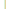
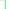
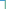

# Content Management System

This section houses various user interface design elements and defines how they behave, what they look like and in some cases how they are coded. It also documents how various elements behave in different context, use of language and common flow patterns through the apps.

## Type

The type throughout the content management system uses Google’s Lato font-family. Various font styles are used throughout the CMS to establish a sense of hierarchy in the content and controls.

<ul class="main__content__block styling__block padding__100"  markdown="0">
	<li class="type__block">
		
Page Title

		
The quick brown fox jumps over the lazy dog

		

			Size: 27px
			Weight: Regular
			Letter-Spacing: -0.5px
		

	</li>
	<li class="type__block">
		
Secondary &amp; Modal Title

		
The quick brown fox jumps over the lazy dog

		

			Size: 18px
			Weight: SemiBold
			Letter-Spacing: -0.5px
		

	</li>
	<li class="type__block">
		
Paragraph

		
The quick brown fox jumps over the lazy dog

		

			Size: 15px
			Weight: Regular
			Letter-Spacing: -0.3px
		

	</li>
	<li class="type__block">
		
Micro

		
The quick brown fox jumps over the lazy dog

		

			Size: 11px
			Weight: Regular
			Letter-Spacing: 0
		

	</li>
	<li class="type__block">
		
Warning

		
The quick brown fox jumps over the lazy dog

		

			Size: 15px
			Weight: Regular
			Letter-Spacing: -0.3px
		

	</li>
	<li class="type__block">
		
Link

		<a href="#" class="text--link">Edit Permissions</a>
		

			Size: 15px
			Weight: Regular
			Letter-Spacing: 0
		

	</li>
	<li class="type__block">
		
Micro Link

		<a href="#" class="text--link--micro">12 Groups</a>
		

			Size: 13px
			Weight: Regular
			Letter-Spacing: -0.3px
		

	</li>
</ul>

## Colour Palette

The colours below are used throughout the CMS and each specifies the hexcode and LESS names for the colour.   

<ul class="main__content__block padding__30"  markdown="0">
	<h3 class="float__left width__100">Text Colours</h3>
	<li class="colour__block colour__block--one">
		

			
$cmsGrey

			
#6A6F75

		

	</li>
	<li class="colour__block colour__block--two">
		

			
$cmsPlaceholder

			
#6A6F75

		

	</li>
	<li class="colour__block colour__block--three">
		

			
$cmsLink

			
#0570B6

		

	</li>
	<li class="colour__block colour__block--four">
		

			
$red

			
#6A6F75

		

	</li>
</ul>

<ul class="main__content__block padding__30"  markdown="0">
	<h3 class="float__left width__100">Button Colours</h3>
	<li class="colour__block colour__block--five">
		

			
$buttonPrimary

			
#00B5EB

		

	</li>
	<li class="colour__block colour__block--six">
		

			
$buttonSecondary

			
#D2D9E1

		

	</li>
	<li class="colour__block colour__block--seven">
		

			
$buttonSecondaryText

			
#657D98

		

	</li>
</ul>

<ul class="main__content__block padding__100"  markdown="0">
	<h3 class="float__left width__100">Background Colours</h3>
	<li class="colour__block colour__block--eight">
		

			
$tableRow

			
#F7F7F7

		

	</li>
	<li class="colour__block colour__block--nine">
		

			
$textHead

			
#E7F2F9

		

	</li>
	<li class="colour__block colour__block--ten">
		

			
$componentBorder

			
#E1E1E1

		

	</li>
</ul>

## Buttons

We use buttons throughout the CMS for important actions such as "Save Changes" and "Search." Primary buttons are used for these postive actions, and secondary buttons are used for the neutral options. Mini versions of these buttons are used in search bars.

	<button class="button--primary">Primary Button</button>
	<button class="button--primary button--disabled">Disabled Button</button>
	<button class="button--secondary">Secondary Button</button>
	 
	<button class="button--primary button--mini">Mini Primary Button</button>
	<button class="button--secondary button--mini">Mini Secondary Button</button>

## Tags

Tags are used to specify what groups users belong to. When an app editor defines the audience for a list or piece of content they choose the user groups for whom the content is for.

The groups appear as tags and can be removed from the audience by pressing the "x" on the tag to remove it. If a user group added to the audience but will not be able to access it as they cannot see the parent list/lists this tag will appear in red.  

<ul class="main__content__block padding__100"  markdown="0">
	<li class="tag">Group that can see this content</li>
	<li class="tag">Another group name</li>
	<li class="tag">Group</li>
	<li class="tag tag--negative">Group with no way to access content</li>
</ul>

## Form Elements

Some info on forms

     <label for="FirstName">First Name</label>
     <input autocomplete="off" class="" id="FirstName" name="FirstName" placeholder="First Name" type="text" value="first"/>

     <label for="LastName">Last Name</label>
     <input autocomplete="off" class="" id="LastName" name="LastName" placeholder="Last Name" type="text" value="last"/>

	

		<h4 class="form--dataFieldsHeading">Form Data Fields</h4>
		<label>Username</label>
		user@emailaddress.com
	

	

		<h4 class="form--dataFieldsHeading">Form Data Fields</h4>
		<label>Password</label>
		
Reset Password

	

	<h4 class="form--dataFieldsHeading">Checkbox</h4>
  <input type="checkbox" checked="checked">
	Can be access by all users in the organization.

	<h4 class="form--dataFieldsHeading">Dropdown</h4>
	<select>
		<option value="App Name">App Name</option>
	  <option value="Author">Author</option>
	  <option value="App Grid">App Grid</option>
	</select>

## Tables

Below are the styles used throughout the tables on the CMS.

	<table class="table-allUsers">
		<tbody>
		<tr class="table-RowOne">
				<th>
					Username ▲
				</th>
				<th>
					First Name
				</th>
				<th>
					Last Name
				</th>
				<th>
					Job Role
				</th>
				<th>
				</th>
		</tr>
		<tr>
			<td class="table-columnOne">
				john.morisson@theappbuilder.com
			</td>
			<td>
				John
			</td>
			<td>
				Morisson
			</td>
			<td>
			  IT Manager
			</td>
			<td class="table-columnFive">
							
			</td>
		</tr>
		<tr>
			<td class="table-columnOne">
				peter.graham@theappbuilder.com
			</td>
			<td>
				Peter
			</td>
			<td>
				Graham
			</td>
			<td>
				Global Director
			</td>
			<td class="table-columnFive">
				
			</td>
		</tr>
		<tr>
			<td class="table-columnOne">
				alison.beattie@theappbuilder.com
			</td>
			<td>
				Alison
			</td>
			<td>
				Beattie
			</td>
			<td>
				Public Relations
			</td>
			<td class="table-columnFive">
				
			</td>
		</tr>
		<tr>
			<td class="table-columnOne">
				mark.mccaigue@theappbuilder.com
			</td>
			<td>
				Mark
			</td>
			<td>
				McCaigue
			</td>
			<td>
				HR Manager
			</td>
			<td class="table-columnFive">
				
			</td>
		</tr>
		<tr>
			<td class="table-columnOne">
				jake.curry@theappbuilder.com
			</td>
			<td>
				Jake
			</td>
			<td>
				Curry
			</td>
			<td>
				Managing Director
			</td>
			<td class="table-columnFive">
				
			</td>
		</tr>
		<tr>
			<td class="table-columnOne">
				melissa.keizer@theappbuilder.com
			</td>
			<td>
				Melissa
			</td>
			<td>
				Keizer
			</td>
			<td>
				Creative Director
			</td>
			<td class="table-columnFive">
				
			</td>
		</tr>
		</tbody>
</table>

## Search Users

Below are the styles used throughout the search fields across the cms.

		

			<form>
				<label class="searchUsers--label" for="search">Search</label>
				<input class="searchUsers--searchBox" name="Search" placeholder="Search by ID, name, job role, status" type="text">
				<button class="searchUsers--closeIcon" type="reset">X</button>
				<input class="searchUsers--submitButton" value="Search" type="submit">
				<input class="searchUsers--resetButton" value="Reset" type="button">
			</form>
		
<!--end of searchUsers__block div-->
	
<!--en of main__content__block div-->

<!--Search and Select Groups------------------------------------------------------------------------------------------------------------------------------------------------

### Search and Select groups

<form class="searchSelectGroups--block">
  <input class="searchSelectGroups--input" type="text" placeholder="Search for Groups" name="search" onkeyup="this.setAttribute('value', this.value);" value="">
  <button class="searchSelectGroups--addButton" type="submit">Add</button>
</form>

---------------------------------------------------------------------------------------------------------------------------------------------------------------------------->

## Iconography

Below are the typical icons used throughout the CMS to give clear visual direction to what the button or section is about.

		<table class="iconography--block">
			<tr>
					<td>
						
					</td>
					<td>
						tick in the checkbox
					</td>
					<td>
						
					</td>
					<td>
						remove from table
					</td>
					<td>
						
					</td>
					<td>
						delete
					</td>
			</tr>

<!--end of first table row-->

			<tr>
					<td>
						
					</td>
					<td>
						group access
					</td>
					<td>
						
					</td>
					<td>
						close modal
					</td>
					<td>
						
					</td>
					<td>
						clear search
					</td>
			</tr>

<!--end of second table row-->

			<tr>
				<td>
					
				</td>
				<td>
					user group locked
			  </td>
				<td>
					
		  	</td>
			  <td>
					user group unlocked
				</td>
			  <td>
					
				</td>
			  <td>
					error or warning
			  </td>
			</tr>

<!--end of third table row-->

			<tr>
				<td>
					
				</td>
				<td>
					blue remove icon
				</td>
			</tr>

<!--end of fourth table row-->
		</table>

<!--end of iconography--block div-->

## Navigation

In page tabs

	

		<ul class="navigation__list">
			<li><a class="navigation__listItem" id="navigation__listItem--1" href="#navigation__listItem--1">Channel Overview</a></li>
			<li><a class="navigation__listItem" id="navigation__listItem--2" href="#navigation__listItem--2">User Groups</a></li>
			<li><a class="navigation__listItem" id="navigation__listItem--3" href="#navigation__listItem--3">Users</a></li>
			<li><a class="navigation__listItem" id="navigation__listItem--4" href="#navigation__listItem--4">User Profile</a></li>
			<li><a class="navigation__listItem" id="navigation__listItem--5" href="#navigation__listItem--5">Channels</a></li>
			<li><a class="navigation__listItem" id="navigation__listItem--6" href="#navigation__listItem--6">Admin Details</a></li>
		</ul>
	

<h4>Sidebar</h4>

	

		<ul class="navigation__sidebar--title">
		 	<li>TheAppBuilder</li>
		</ul>

		<ul class="navigation__sidebar">
			<a id="sidebar__listItem--1" href="#sidebar__listItem--1"><li>Users</li></a>
			<li><a id="sidebar__listItem--2" href="#sidebar__listItem--2">User Groups</a></li>
			<li><a id="sidebar__listItem--3" href="#sidebar__listItem--3">Builds</a></li>
			<li><a id="sidebar__listItem--4" href="#sidebar__listItem--4">Channels</a></li>
			<li><a id="sidebar__listItem--5" href="#sidebar__listItem--5">Branding</a></li>
		</ul>
	

